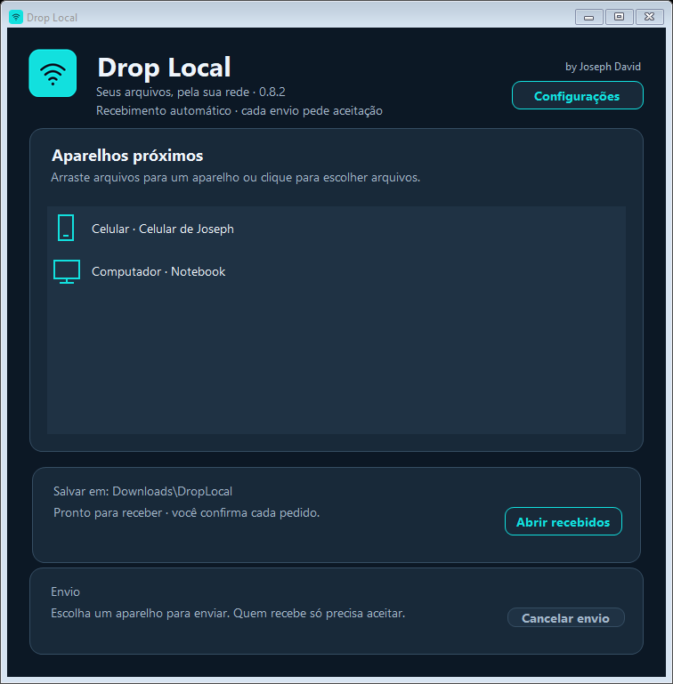
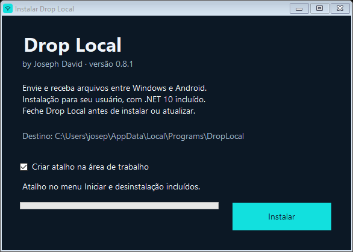

# Drop Local

**by Joseph David** · Windows e Android · versão 0.5.1

Transfira arquivos diretamente entre PC e celular na mesma rede local. Aplicativos nativos com tema escuro, abas Enviar / Receber, progresso, cancelamento e confirmação de cada pedido. O Windows oferece QR para pareamento; a entrada manual continua disponível.

## Download e instalação

Baixe o instalador Windows e o APK em [Releases](https://github.com/JosephDavid2/DropLocal/releases). Consulte [o guia da versão 0.5.1](USAR-0.5.1.md).

- Windows x64: `DropLocal-Setup-0.5.1.exe`, com runtime .NET Desktop privado, atalhos e desinstalador por usuário. Requer .NET Framework 4.x para o assistente. Instalador sem certificado Authenticode.
- Android 8 ou superior: `DropLocal-Android-0.5.1.apk`. Instale sobre a versão anterior para preservar a atualização com a mesma assinatura.

## Interface






## Como funciona

Na aba Receber, escolha a pasta e inicie o receptor. No outro dispositivo, selecione arquivos e informe IP/código ou use o QR do Windows. Aceite o pedido no destino. Mudar de aba preserva os dados e o receptor ativo.

TCP 45832 no Android e 45833 no Windows. Sem servidor externo e sem TLS; use uma rede confiável. Limite de 1000 arquivos, buffers de 64 KiB, sem retomada. O Android prepara cópias temporárias e deve permanecer em primeiro plano para aceitar pedidos.

## Código e compilação

`windows/` contém o aplicativo WinForms (.NET 10); `android/` contém o aplicativo Java; `installer/` contém assistente, launcher e desinstalador. `tests/` cobre transporte e leitura de QR. `assets/` contém a identidade visual.

```powershell
dotnet publish windows/DropLocal.csproj -c Release --self-contained false -o dist/windows
./Build-Windows-Installer.ps1
./Build-Android.ps1 -Offline
```

O instalador usa o runtime 10.0.12 instalado no caminho informado em `-DotnetRoot`, além do compilador .NET Framework do Windows. Android usa JDK 17, Gradle 8.11.1 e SDK/Build Tools 35; consulte `Build-Android.ps1` para configuração local. Caches, ferramentas, chaves privadas e saídas de compilação não são versionados. Preserve sua chave de assinatura para atualizar o APK.

## Validação

```powershell
dotnet run --project tests/ProtocolTests.csproj -c Release
./dist/windows/DropLocal.exe --verify-startup
./dist/windows/DropLocal.exe --verify-navigation dist/ui-check
```

Os testes cobrem autenticação, aceitação/recusa, cancelamento, desconexão, pareamento, arquivos binários, Unicode e vazios. O teste integrado verifica uma única janela, preservação das abas e transferência em loopback. O usuário confirmou fisicamente o QR na 0.4.1 e todos os recursos da 0.5. A 0.5.1 adiciona autoria e empacotamento; o guia distingue verificações automatizadas de testes físicos.

Histórico da correção do QR: [QR 0.4.1](docs/historico/QR-0.4.1.md).

